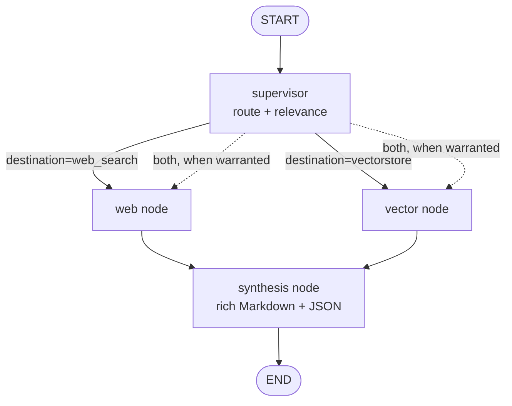

# Phase 6 — LangGraph Multi-Agent Orchestrator + SSE Streaming + Rich Output

> **✅ STATUS: COMPLETE (2026-06-02).** Shipped on branch `phase6-backend`: `agents/` LangGraph (supervisor → vector/web → synthesis) replacing the linear flow; dual-transport `/api/chat` (JSON via `graph.ainvoke`, SSE token/status/component/done/error via `graph.astream`, hand-rolled `sse.py` — **`sse-starlette` not needed**); 3-tier freemium ladder (BYOK → free-tier Redis allowance → 402 `FreeTierExhaustedError`) with per-node cheap/strong **model tiering** + **prompt caching**; conversation **memory** (`messages` table, last-N turns into `GraphState.history`); **guest auth** (`User.is_guest` + JWT claim, `POST /api/auth/guest` + `/api/auth/upgrade`) and `GET /api/keys`. Auth + rate-limit + the 402 gate **before** the stream opens. Graph compiled once per process, shared, stateless. Tests: 290 passing with the NeonDB TestDB; **`--cov-fail-under=82`** (82.36%); mypy clean on `agents/ llm/ auth/ sse.py`. The migration chain head is `a7f3c1e9d4b6` (adds `users.is_guest`).
>
> **Implementer:** this is the detailed plan for **Phase 6**. See the top-level [00_Master_Upgrade_Roadmap.md](./00_Master_Upgrade_Roadmap.md) §4 (Phase 6) for context. This phase follows [06_Phase5_Redis_Scaling.md](./06_Phase5_Redis_Scaling.md) and must not begin until the Phase 5 CI gate is green. This is the last numbered phase doc (`01`–`07`); anything beyond it lands in a future Phase 7.
>
> **Authoritative design:** the agentic-architecture decisions in this doc are refined and superseded by [`09_Phase6_Agentic_Architecture.md`](./09_Phase6_Agentic_Architecture.md) (decided 2026-05-30) — note its two corrections: the vector store is **Pinecone** (not "Chroma") and the provider protocol is **`llm.base.LLMProvider`** (not `providers.base.Provider`).

## 1. Objective & scope

### In scope
- Introduce a new **`agents/` package** built on **LangGraph**: a `StateGraph` with a **supervisor** node plus **web-search**, **vector**, and **synthesis** sub-agents. This **replaces the manual `decide_combined_route` linear flow** that currently lives in `app.py`.
- Define a typed graph **state** (a `TypedDict`) that carries the query, the **injected per-user provider** (from Phase 4), retrieved context, sub-agent outputs, the route decision, and the running answer. The provider/clients flow **through state**, never as module globals.
- Refactor `components/retrieval.py` and `components/generation.py` into **node-callable functions** that read the provider from state (the Phase-4 per-request `Provider`), not Gemini globals.
- Stream the chat response over **SSE** (Server-Sent Events) on `/api/chat`: emit generated **tokens** plus **intermediate sub-agent status events** (`routing`, `searching web`, `retrieving`, `synthesizing`, `done`, `error`).
- Produce **rich structured output** from the synthesis node: Markdown with images (``) and an optional JSON block describing interactive component schemas.
- **Behavior parity first:** the graph must reproduce the old linear `route → relevance → retrieve → generate` result before parallel retrieval edges are switched on.

### Explicitly deferred (→ Phase 7)
- **3-layer memory** (working / episodic / semantic).
- **Knowledge graph** retrieval.
- **OpenTelemetry tracing** / distributed spans across graph nodes.

These are out of scope here; do not pull them forward (roadmap §8).

## 2. Decisions & rationale

| Decision | Rationale | Alternatives considered |
|----------|-----------|-------------------------|
| LangGraph `StateGraph` orchestrator | Explicit nodes/edges, typed state, native fan-out/fan-in, already a dependency | Keep hand-rolled `decide_combined_route` (no parallelism, no streaming hooks) |
| Provider/clients carried **in graph state** | Each request injects its own per-user provider (Phase 4); nodes must be stateless and global-free | Read a module global inside nodes (breaks multi-tenant + tests) |
| Supervisor node replaces `decide_combined_route` | One routing decision becomes a first-class node with the same JSON contract | Inline routing in the endpoint (un-streamable, untestable in isolation) |
| **SSE** over `text/event-stream` | Simple, one-way, proxy-friendly, native browser `EventSource` | WebSockets (bidirectional overhead we don't need); long-poll (clunky) |
| Hand-rolled SSE first; `sse-starlette` optional | Zero new deps if a thin generator suffices; adopt the lib only if event framing/heartbeats get fiddly | Mandatory new dep up front (avoid until justified) |
| Parity before parallelism | De-risk the rewrite: prove identical answers, then add fan-out edges | Ship graph + parallel + streaming in one leap (unverifiable) |
| Structured Markdown/JSON synthesis | Front-end can render images + interactive components | Plain-text answers (loses rich UI) |

## 3. Current-state snapshot (verified after Phases 1–5)

- **DI is complete.** Settings, the Pinecone collection, the DB session, the Redis cache, and the **per-request LLM `Provider`** are all injected via `Depends` and overridable in tests.
- **Postgres** stores chat history and document metadata (Phase 2); **JWT auth + per-user isolation** are enforced (Phase 3).
- The LLM lives behind a **`Provider` protocol selected per-request** (Phase 4); Gemini is one adapter. Generation/relevance no longer touch Gemini globals — they call the injected provider.
- **Redis caching, Celery ingestion, presigned uploads, rate-limiting** are live (Phase 5). Uploads return `202`; ingestion runs in workers.
- **The chat flow is still linear.** `POST /api/chat` runs `decide_combined_route → (web | retrieve) → generate` sequentially and returns **one non-streaming JSON blob**:
  - `app.py` `chat()` calls `decide_combined_route(...)`, branches on `route["destination"]`, then `generate_web_answer` or `retrieve_context` + `generate_answer`, then returns `{"answer", "route"}`.
  - `components/router.py::decide_combined_route` makes a single JSON-mode LLM call returning `{"destination", "relevant"}`.
  - `components/retrieval.py::retrieve_context` embeds the query, queries Pinecone, concatenates docs.
  - `components/generation.py::generate_answer` / `generate_web_answer` produce a grounded / open answer.
- There is **no `agents/` package**, **no graph**, and **no streaming** anywhere yet.

## 4. Risks & gotchas (with resolutions)

- **Provider must travel in state, not a global.** Each request carries a different per-user provider (Phase 4). If a node closes over a module global, multi-tenant requests cross-contaminate and tests can't override it. **Resolution:** put the provider (and the Pinecone collection / cache handle) into the initial `GraphState`; nodes read `state["provider"]`. The compiled graph is stateless and shared on `app.state`; per-request data lives only in the invocation's state.
- **SSE × auth × rate-limit interplay.** A `StreamingResponse` still needs the JWT validated and the rate-limit consumed **before** the stream opens — once headers are flushed you can't return a clean `401`/`429`. **Resolution:** keep auth + rate-limit as ordinary `Depends` on the endpoint; they run and can raise before the generator is returned. Only graph execution happens inside the stream.
- **Backpressure / cancellation on disconnect.** If the client drops mid-stream, the graph keeps running and burns provider tokens. **Resolution:** check `await request.is_disconnected()` between yields and break; wrap the graph stream in a `try/finally` that cancels the task and closes provider/clients.
- **Behavior parity with the linear flow.** A subtle change in routing or grounding will silently regress answers. **Resolution:** golden-path parity test — same query, mocked provider returns fixed outputs, assert the final answer equals the old linear result **before** enabling parallel retrieval edges.
- **Structured-output JSON validity.** The synthesis prompt asks for Markdown plus a JSON component block; models emit malformed JSON. **Resolution:** validate the JSON block against a pydantic schema; on parse failure, drop the block and stream the Markdown only (never 500). Mirror the existing `decide_combined_route` defensive `try/except` pattern.
- **Token streaming vs. provider capability.** Not every provider streams tokens. **Resolution:** if the provider exposes a streaming generate, forward chunks; otherwise emit the whole answer as one `token` event — the SSE event contract is identical either way.
- **Fan-out state merges.** Parallel `web` + `vector` nodes both write to state; LangGraph needs a reducer or disjoint keys or the second write clobbers the first. **Resolution:** give each branch its **own** state key (`web_result`, `vector_result`); synthesis reads both. No shared mutable key.
- **Graph compiled per request = slow.** Compiling on every call wastes work. **Resolution:** compile **once** in the lifespan handler and stash on `app.state.graph`; inject it via a `Depends`.

## 5. Tasks (ordered)

### Task 1 — Typed graph state (`agents/state.py`)
**Test first:** `tests/agents/test_state.py` — a well-formed `GraphState` dict type-checks; required keys present; the provider slot accepts a fake provider.
**Implement:** `agents/state.py` with a `GraphState(TypedDict)` carrying query, session/user ids, the injected `provider`, the Pinecone `collection`, `route`, `web_result`, `vector_result`, `context`, `answer`, and `events`. See Appendix B.
**Acceptance:** state imports, type-checks under mypy, and carries the provider as a field (no global).

### Task 2 — Node functions (web-search, vector, synthesis)
**Test first:** `tests/agents/test_nodes.py` — each node in **isolation** with a **mocked provider/collection** from state. `vector_node` returns retrieved context; `web_node` returns an open answer; `synthesis_node` returns rich Markdown + a valid (or gracefully dropped) JSON block.
**Implement:** `agents/nodes.py`. Refactor `components/retrieval.py::retrieve_context` and `components/generation.py::{generate_answer, generate_web_answer}` into node-callable functions that take **`provider` and `collection` from `state`**, then have the nodes wrap them. Each node returns a **partial state update** dict (LangGraph merge semantics).
**Acceptance:** every node passes in isolation with only a fake provider/collection; no node references a module global; `components/*` call the injected provider, not Gemini.

### Task 3 — Supervisor / routing node (replaces `decide_combined_route`)
**Test first:** `tests/agents/test_supervisor.py` — given a query, the supervisor sets `state["route"]` to `{"destination", "relevant"}`; malformed model JSON falls back to `{"destination": "vectorstore", "relevant": True}` (same defensive default as today).
**Implement:** `supervisor_node` in `agents/nodes.py` porting `decide_combined_route`'s JSON-mode prompt to call `state["provider"]`. Add a conditional-edge router function that maps the decision to the next node(s).
**Acceptance:** the supervisor reproduces the old routing contract exactly, including the fallback.

### Task 4 — Compile the `StateGraph` (`agents/graph.py`)
**Test first:** `tests/agents/test_graph.py` — `build_graph()` compiles; a full invoke with a mocked provider yields a final state whose `answer` **equals the old linear flow's answer** for the same query (parity). Then a separate test asserts both retrieval branches run when the route warrants it.
**Implement:** `agents/graph.py` with `build_graph()` adding nodes (`supervisor`, `web`, `vector`, `synthesis`), a conditional edge from `supervisor`, **parallel edges** into `web`/`vector` where applicable, and a fan-in into `synthesis → END`. See Appendix A. Compile and return the runnable graph.
**Acceptance:** graph compiles; parity test green **before** parallelism is exercised; fan-out test green after.

### Task 5 — Compile in lifespan / provide it (`app.py`, `dependencies.py`)
**Test first:** `tests/test_graph_di.py` — `app.state.graph` exists after startup; a `get_graph` dependency returns it and is overridable.
**Implement:** build the graph once in the FastAPI `lifespan` handler, store on `app.state.graph`; add `get_graph()` in `dependencies.py` reading from `app.state`.
**Acceptance:** one compile per process; graph injectable and overridable in tests.

### Task 6 — Rewrite `/api/chat` to invoke the graph and stream SSE
**Test first:** `tests/test_chat_sse.py` — POST to `/api/chat`; assert the **event sequence** (`routing` → `retrieving`/`searching web` → `synthesizing` → `token`* → `done`) and that the concatenated `token` events equal the final answer. A second test asserts auth/rate-limit still gate the endpoint **before** the stream opens.
**Implement:** replace the linear body of `chat()` with: build the **initial `GraphState`** (query + **injected per-user provider** + collection), `astream` the compiled graph, and translate node updates into SSE events via a `StreamingResponse(media_type="text/event-stream")`. Persist the final answer to Postgres after the stream completes. Handle disconnect/cancellation in a `try/finally`. See Appendix C for the event catalog and the SSE helper.
**Acceptance:** SSE streams token + status events; final answer persisted; provider injected into initial state; auth + rate-limit unchanged.

### Task 7 — Structured rich-output synthesis prompt
**Test first:** `tests/agents/test_rich_output.py` — synthesis output contains valid Markdown; when the model emits a component JSON block it validates against the schema; a malformed block is dropped, not fatal.
**Implement:** update `synthesis_node`'s prompt to request Markdown (with `` images) plus an optional fenced JSON block of interactive component schemas; validate the block with a pydantic model; drop on failure.
**Acceptance:** rich Markdown emitted; valid component JSON passes; malformed JSON degrades gracefully.

### Task 8 — Coverage ratchet, mypy, lock
**Implement:** raise `--cov-fail-under` to **82**; mypy clean on `agents/` (`state.py`, `graph.py`, `nodes.py`) and the rewritten `chat` path. If you adopt `sse-starlette`, `uv add sse-starlette` and `uv lock`; otherwise no new deps.
**Acceptance:** CI green at the new floor; mypy clean on all new/changed modules; lockfile updated only if a dep was added.

## 6. Exit criteria

- The **LangGraph `StateGraph` orchestrates** the chat flow (supervisor + web/vector/synthesis), **replacing** `decide_combined_route`; **parallel retrieval** runs when the route warrants it.
- **SSE streams** token + sub-agent status events to the client on `/api/chat`.
- **Each node uses the per-user provider** taken from graph state — no Gemini globals anywhere in `agents/` or `components/`.
- Behavior parity verified against the old linear flow before parallelism was enabled.
- Roadmap §5 Phase 6 gate met: **graph-node unit tests** (each node isolated with mocked provider/clients) and an **SSE streaming test** (event sequence + final answer) are green; **`--cov-fail-under=82`**.
- mypy clean on `agents/` and the rewritten chat endpoint; lockfile updated iff `sse-starlette` adopted.

## Appendix A — Graph topology



ASCII fallback:

```
            +-------------------+
   START -> |    supervisor     |  route + relevance (replaces decide_combined_route)
            +---------+---------+
                      | conditional edge
        +-------------+--------------+
        v                            v
  +-----------+                +-----------+
  |   web     |                |  vector   |   (run in PARALLEL when the route warrants both)
  | (open ans)|                | (retrieve)|
  +-----+-----+                +-----+-----+
        |   write web_result         |  write vector_result
        +-------------+--------------+
                      v  (fan-in)
              +---------------+
              |   synthesis   |  rich Markdown + optional component JSON
              +-------+-------+
                      v
                     END
```

Each branch writes a **disjoint** state key (`web_result` vs `vector_result`) so the parallel fan-out cannot clobber a sibling's write; `synthesis` reads both.

## Appendix B — `GraphState` (TypedDict) schema

```python
# agents/state.py
from typing import Any, TypedDict
from typing_extensions import NotRequired
from llm.base import LLMProvider   # Phase 4 protocol


class RouteDecision(TypedDict):
    destination: str   # "web_search" | "vectorstore"
    relevant: bool


class GraphState(TypedDict):
    # --- inputs (set when the request builds the initial state) ---
    query: str
    session_id: str
    user_id: str
    provider: LLMProvider                 # per-user, injected — NOT a global
    collection: Any                    # Pinecone collection handle

    # --- produced by nodes ---
    route: NotRequired[RouteDecision]  # supervisor
    web_result: NotRequired[str]       # web node (disjoint key)
    vector_result: NotRequired[str]    # vector node (disjoint key)
    context: NotRequired[str]          # concatenated retrieved context
    answer: NotRequired[str]           # synthesis final answer
    events: NotRequired[list[dict]]    # status events emitted en route
```

| Field | Set by | Purpose |
|-------|--------|---------|
| `query` | request | The user question |
| `session_id` / `user_id` | request | Persistence + per-user isolation (Phase 2/3) |
| `provider` | request (injected) | Per-user LLM `Provider` (Phase 4); every node reads this |
| `collection` | request (injected) | Pinecone handle for the vector node |
| `route` | supervisor node | `{destination, relevant}` — old `decide_combined_route` contract |
| `web_result` | web node | Open-knowledge answer (disjoint key for safe fan-out) |
| `vector_result` | vector node | Retrieved doc text (disjoint key for safe fan-out) |
| `context` | vector node | Concatenated context fed to synthesis |
| `answer` | synthesis node | Final rich Markdown answer |
| `events` | all nodes | Status events surfaced over SSE |

## Appendix C — SSE event-type catalog + helpers

**Event types** streamed on `text/event-stream`:

| `event:` | `data:` payload | Emitted when |
|----------|-----------------|--------------|
| `status` | `{"stage": "routing"}` | supervisor starts |
| `status` | `{"stage": "searching web"}` | web node starts |
| `status` | `{"stage": "retrieving"}` | vector node starts |
| `status` | `{"stage": "synthesizing"}` | synthesis node starts |
| `token` | `{"text": "..."}` | each generated chunk (or one final chunk if provider can't stream) |
| `done` | `{"answer": "...", "route": {...}}` | stream complete; final answer + route |
| `error` | `{"detail": "..."}` | any node raises; closes the stream cleanly |

**SSE framing helper (hand-rolled; no new dep):**

```python
import json
from typing import Any

def sse(event: str, data: dict[str, Any]) -> str:
    return f"event: {event}\ndata: {json.dumps(data)}\n\n"
```

**Streaming endpoint sketch (`app.py`):**

```python
from fastapi import Depends, Request
from fastapi.responses import StreamingResponse

@app.post("/api/chat")
async def chat(
    req: ChatRequest,
    request: Request,
    provider=Depends(get_provider),          # per-user (Phase 4)
    collection=Depends(get_pinecone_index),
    graph=Depends(get_graph),                 # compiled once in lifespan
    user=Depends(get_current_user),           # auth (Phase 3) — runs BEFORE stream
    _rl=Depends(rate_limit),                   # rate-limit (Phase 5) — runs BEFORE stream
):
    state: GraphState = {
        "query": req.query,
        "session_id": req.session_id,
        "user_id": user.id,
        "provider": provider,                  # provider flows via STATE, not a global
        "collection": collection,
    }

    async def event_stream():
        final_answer, final_route = "", None
        try:
            async for update in graph.astream(state):
                if await request.is_disconnected():
                    break
                for node, partial in update.items():
                    if "route" in partial:
                        yield sse("status", {"stage": "routing"})
                        final_route = partial["route"]
                    if "vector_result" in partial:
                        yield sse("status", {"stage": "retrieving"})
                    if "web_result" in partial:
                        yield sse("status", {"stage": "searching web"})
                    if "answer" in partial:
                        yield sse("status", {"stage": "synthesizing"})
                        for chunk in chunk_text(partial["answer"]):
                            yield sse("token", {"text": chunk})
                        final_answer = partial["answer"]
            yield sse("done", {"answer": final_answer, "route": final_route})
        except Exception as exc:               # never leak a 500 mid-stream
            yield sse("error", {"detail": str(exc)})
        finally:
            await persist_turn(user.id, req.session_id, req.query, final_answer)

    return StreamingResponse(event_stream(), media_type="text/event-stream")
```

Auth and rate-limit are ordinary `Depends`, so a `401`/`429` is raised **before** the `StreamingResponse` is constructed — headers are never flushed prematurely.

## Appendix D — Node sketch (provider from state)

```python
# agents/nodes.py
from agents.state import GraphState

def supervisor_node(state: GraphState) -> dict:
    provider = state["provider"]                 # injected, per-user
    decision = route_query(provider, state["query"])   # ported decide_combined_route
    return {"route": decision}                    # partial state update

def vector_node(state: GraphState) -> dict:
    provider, collection = state["provider"], state["collection"]
    context = retrieve_context(collection, provider, state["query"])  # refactored
    return {"vector_result": context, "context": context}

def web_node(state: GraphState) -> dict:
    answer = generate_web_answer(state["provider"], state["query"])   # refactored
    return {"web_result": answer}

def synthesis_node(state: GraphState) -> dict:
    answer = synthesize_rich(                      # rich Markdown + optional JSON block
        state["provider"],
        query=state["query"],
        context=state.get("context", ""),
        web=state.get("web_result", ""),
    )
    return {"answer": answer}
```

Every node takes **only `state`** and reads the provider/collection from it — no module-level Gemini client survives in `agents/` or `components/`.

## Appendix E — Graph build sketch (`agents/graph.py`)

```python
# agents/graph.py
from langgraph.graph import StateGraph, START, END
from agents.state import GraphState
from agents.nodes import (
    supervisor_node, web_node, vector_node, synthesis_node,
)

def route_after_supervisor(state: GraphState) -> list[str]:
    """Conditional edge: map the supervisor decision to the next node(s)."""
    dest = state["route"]["destination"]
    if dest == "web_search":
        return ["web"]
    # vectorstore path; when the route warrants corroboration, fan out to BOTH.
    if state["route"].get("relevant", True):
        return ["vector"]
    return ["web", "vector"]            # parallel fan-out (disjoint state keys)

def build_graph():
    g = StateGraph(GraphState)
    g.add_node("supervisor", supervisor_node)
    g.add_node("web", web_node)
    g.add_node("vector", vector_node)
    g.add_node("synthesis", synthesis_node)

    g.add_edge(START, "supervisor")
    g.add_conditional_edges("supervisor", route_after_supervisor,
                            {"web": "web", "vector": "vector"})
    g.add_edge("web", "synthesis")     # fan-in
    g.add_edge("vector", "synthesis")  # fan-in
    g.add_edge("synthesis", END)
    return g.compile()
```

Compile **once** in the lifespan handler and stash it:

```python
# app.py (lifespan)
from contextlib import asynccontextmanager
from agents.graph import build_graph

@asynccontextmanager
async def lifespan(app):
    app.state.graph = build_graph()    # one compile per process
    yield
```

## Appendix F — Parity test (linear → graph)

Prove the graph reproduces the old linear answer **before** turning on parallelism.

```python
# tests/agents/test_graph.py
import pytest
from agents.graph import build_graph

@pytest.mark.anyio
async def test_graph_parity_with_linear_flow(fake_provider, fake_collection):
    """Same query + fixed provider outputs => same answer as decide_combined_route."""
    fake_provider.route_returns = {"destination": "vectorstore", "relevant": True}
    fake_provider.gen_returns = "Grounded answer."
    fake_collection.docs = ["doc-a", "doc-b"]

    graph = build_graph()
    final = await graph.ainvoke({
        "query": "what is X?",
        "session_id": "s1",
        "user_id": "u1",
        "provider": fake_provider,
        "collection": fake_collection,
    })

    assert final["route"] == {"destination": "vectorstore", "relevant": True}
    assert final["answer"] == "Grounded answer."   # identical to the old linear path
```

The SSE counterpart asserts the **event order** and that the concatenated `token`
events reconstruct `final["answer"]`:

```python
# tests/test_chat_sse.py (excerpt)
events = parse_sse(resp.iter_lines())
stages = [e["data"]["stage"] for e in events if e["event"] == "status"]
assert stages == ["routing", "retrieving", "synthesizing"]
answer = "".join(e["data"]["text"] for e in events if e["event"] == "token")
assert answer == "Grounded answer."
assert events[-1]["event"] == "done"
```

## Appendix G — Old-linear → new-node mapping

| Old (linear, `app.py` + `components/`) | New (graph node) | Notes |
|----------------------------------------|------------------|-------|
| `decide_combined_route(client, query)` | `supervisor_node` | Same `{destination, relevant}` contract + fallback; calls injected provider |
| `route["destination"] == "web_search"` branch | conditional edge from supervisor | Branch becomes a graph edge |
| `generate_web_answer(client, query)` | `web_node` | Provider from state; writes `web_result` |
| `retrieve_context(collection, client, query)` | `vector_node` | Provider + collection from state; writes `vector_result`/`context` |
| `generate_answer(client, query, context)` | `synthesis_node` | Now rich Markdown + optional component JSON |
| `return {"answer", "route"}` (one JSON blob) | SSE `token` + `status` + `done` events | Streamed, not buffered |
| `load_history`/`save_history` (JSON file) | `persist_turn` to Postgres | Already migrated in Phase 2; called after stream |

## Appendix H — Definition of done checklist

- [ ] `agents/state.py` typed `GraphState` carrying the per-user provider (no global).
- [ ] `agents/nodes.py` web/vector/synthesis + supervisor; each tested in isolation with mocked provider/clients.
- [ ] `components/retrieval.py` + `generation.py` refactored to node-callable, provider-from-state functions.
- [ ] `agents/graph.py` compiles a `StateGraph` with parallel retrieval edges; parity verified before parallelism.
- [ ] Graph compiled once in lifespan; `get_graph` injectable/overridable.
- [ ] `/api/chat` invokes the graph and streams SSE (token + status + done/error); provider in initial state; auth + rate-limit gate before the stream.
- [ ] Rich Markdown/JSON synthesis with graceful JSON-validation fallback.
- [ ] Graph-node tests + SSE event-sequence test green; `--cov-fail-under=82`; mypy clean on `agents/`.
- [ ] `sse-starlette` added + `uv lock` only if hand-rolled SSE proved insufficient.
- [ ] Conventional-commit history; one concern per PR.
