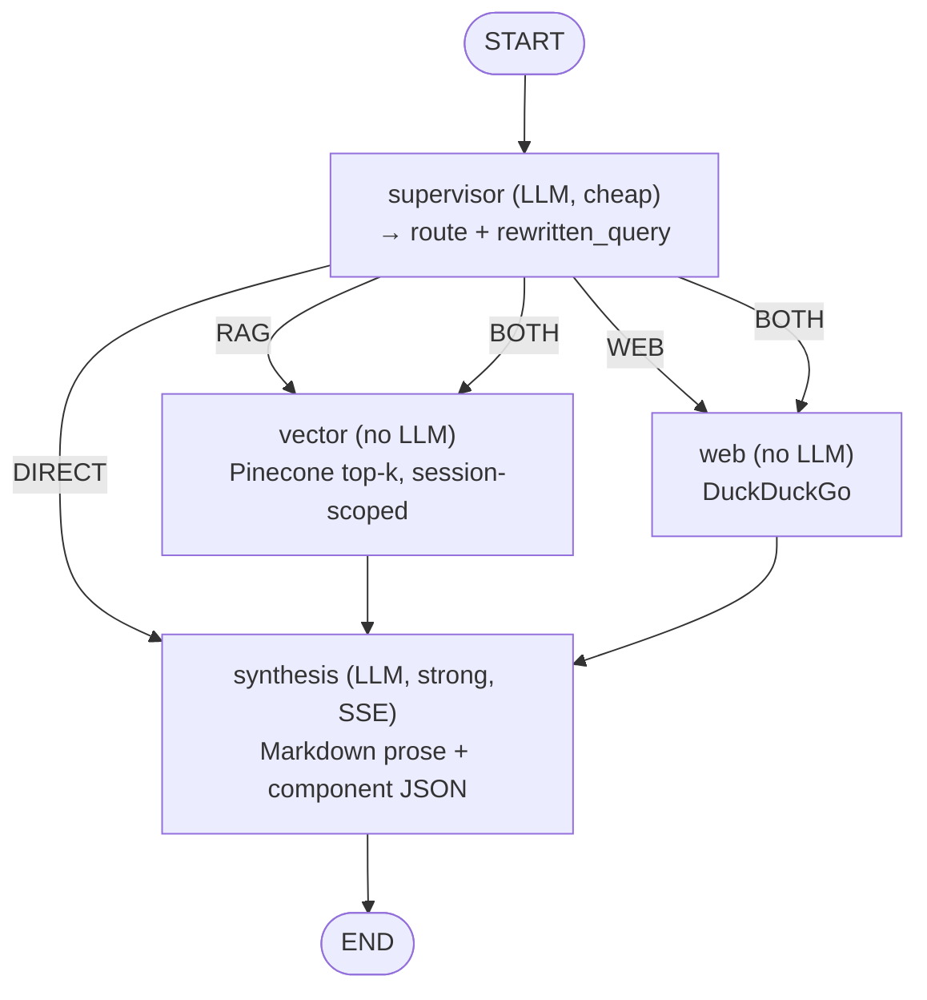

# Phase 6 (Refined) — Agentic Architecture Decision Record

> **What this is.** The locked architecture for the agentic layer, decided 2026-05-30. It is a
> *decision record* — it specifies the shape and the *why*, not a task-by-task plan. The ordered
> implementation tasks already live in [`07_Phase6_LangGraph_and_Streaming.md`](./07_Phase6_LangGraph_and_Streaming.md);
> this document is **authoritative over the design decisions** there. Where the two differ, this wins.
>
> **Cross-phase touchpoints.** The agent graph is Phase 6, but two decisions here reach earlier
> phases: the provider-resolution ladder extends **Phase 4** (`get_llm_provider`, `LLM_FALLBACK_API_KEY`)
> and the free-tier rate limiting is **Phase 5** (slowapi + Redis). Richer memory (hybrid retriever,
> running summary, knowledge graph) stays **Phase 7**.
>
> **Two corrections to `07_Phase6`** that this doc adopts repo-wide: the vector store is **Pinecone**
> (that doc says "Chroma" in places — a stale reference; the actual stack is Pinecone serverless,
> cosine, 384-dim MiniLM embeddings), and the provider protocol is **`llm.base.LLMProvider`** per
> Phase 4 (that doc says `providers.base.Provider`).

## 0. Product context (the "why" behind everything below)

This backend is a **portfolio / demo project**. The dominant user is an *evaluator* — a recruiter or
reviewer who runs a handful of queries to see it work, then leaves. It is **not** (yet) tuned for many
sustained real users. Every decision below optimizes for **friction-free evaluation + near-zero
operator cost**, with **BYOK** as the upgrade path for real, private, unlimited use.

That single fact resolves what would otherwise look like odd choices (e.g. allowing private-document
RAG on a free Google key — see §4).

## 1. Confirmed decisions

| # | Decision | Rationale | Rejected alternatives |
|---|----------|-----------|-----------------------|
| 1 | **LangGraph** as the runtime | Thin state-machine: *we* write the node logic ("from scratch"), it handles state passing, fan-out/fan-in, streaming hooks, checkpointing. Already a dependency; Phase 6 is built around it. Maximum, **predictable** per-node cost. | **CrewAI** (autonomous loops → unpredictable token spend, the one thing the budget can't absorb); **Google ADK** (Gemini/Vertex-centric — fights the multi-provider BYOK headline; younger ecosystem); **pure from-scratch** (reinvents state/streaming/retries for no gain over LangGraph). |
| 2 | Output = **Markdown prose + optional structured component JSON** | Cheap (fewer tokens than HTML), safe (no model-authored executable markup → no XSS), and **streamable**. The frontend renders rich UI from a trusted, fixed component catalog. | **Raw HTML/CSS/JS from a cheap model** — *more* tokens (↑ cost, against the budget), XSS risk, and breaks SSE token streaming (can't render half-open tags). |
| 3 | **4 graph nodes; ~2 LLM calls per query** | Cost ≈ (number of *generation* calls) × (model tier). Retrieval and web search are **not** LLM calls. Keeping it at supervisor + synthesis = 2 calls matches today's cost while adding parallel retrieval and dynamic routing. | A node-per-everything design that turns retrieval into LLM calls; autonomous multi-step agents (unbounded calls). |
| 4 | **Query rewriting folded into the supervisor** | The supervisor's single call returns *both* the route and a context-resolved query — follow-ups like "what about the second one?" work with **zero extra calls**. | Separate rewriter node (+1 LLM call/query); no rewriting (multi-turn follow-ups break). |
| 5 | **Plain top-k retrieval, session-scoped; no re-ranker in v1** | Every search is already scoped by `session_id`, so the corpus searched per query is one session's docs — small. Re-ranking is the *first* thing to add if precision is visibly poor, but it's premature now (adds a hosted cross-encoder dependency). | Cross-encoder re-rank now (over-built for the demo); LLM-based re-rank (expensive). |
| 6 | **No verifier / grounding node in v1** | Keeps it at ~2 calls. A verifier is +1 LLM call (~+50% cost/query); add only if hallucination proves to be a real problem. | Always-on verifier (cost) ; cite-and-check loop (cost + latency). |
| 7 | **Conversation memory = last-N turns, verbatim** | Simple, bounded, makes follow-ups work, no summarization call/storage. The running-summary + knowledge-graph memory is Phase 7. | Running summary now (needs a summarization step + storage early); stateless (no follow-up understanding). |
| 8 | **Model tiering on the BYOK path** (cheap routes, strong synthesizes) | The real cost lever, enabled by Phase 4's per-request provider. Routing is classification → cheap model; synthesis is the quality surface → strong model. Both models come from the **user's one provider** (all three providers have a cheap/strong pair). | One model for everything (overpays on routing or underpowers synthesis). |
| 9 | **Prompt-cache the stable prefixes** | The routing rubric and the (long) synthesis format contract are identical on every call → cache them (provider-native prompt/context caching, up to ~90% cheaper on cached tokens). Retrieved chunks change per query and are *not* cacheable. | No caching (leaves the biggest free saving on the table). |
| 10 | **3-tier freemium provider resolution** (§3) | Lets an evaluator use the app with zero setup (operator's free Google key), keeps operator cost ~0 via rate limiting, and routes real usage to BYOK. Extends Phase 4's `get_llm_provider`. | Pure BYOK (a recruiter won't create a key just to test); operator pays for everyone (cost). |
| 11 | **Free tier allows document RAG, behind a disclaimer** (§4) | The marquee feature an evaluator wants to see *is* RAG; gating it behind BYOK would kill the demo. Mitigated by an upfront notice about Google's free-tier data policy + heavy per-user rate limiting. | BYOK-only for documents (correct for a privacy-first *product*, wrong for a *demo* — explicitly considered and rejected for this project). |

## 2. The graph



| Node | LLM call? | Reads | Produces | Model tier (BYOK path) | Prompt-cached |
|------|-----------|-------|----------|------------------------|---------------|
| **supervisor** | ✅ | `query`, `history` (last-N), `has_documents` | `route ∈ {RAG, WEB, BOTH, DIRECT}`, `rewritten_query` | cheap | routing rubric |
| **vector** | ❌ | `rewritten_query`, `pinecone_index` | `vector_result`, `context`, `docs_relevant` | — | — |
| **web** | ❌ | `rewritten_query` | `web_result` | — | — |
| **synthesis** | ✅ (streamed) | `context`, `web_result`, `history` | `answer` (Markdown), `components` (JSON) | strong | format contract |

- The graph is **compiled once** in the FastAPI `lifespan` and stored on `app.state.graph`; the
  per-request provider/index/history travel **in the invocation state**, never as module globals.
- `vector` and `web` run in **parallel** when `route == BOTH`, writing **disjoint** state keys so the
  fan-in into `synthesis` can't clobber a sibling write.

### 2.1 How document relevance is handled (parity note)

Today's linear flow runs an actual Pinecone probe and keeps the docs only if the top cosine score
≥ **0.4**, then merges routes (the old `WEB+RAG`). The agentic v1 preserves the *relevance gate* but
keeps the graph **acyclic**:

- The supervisor routes on **intent** (does this query want the user's documents?), using only
  `has_documents` — it does not see scores.
- The **vector node still applies the ≥0.4 threshold**. Below it, it sets `docs_relevant = False`,
  drops the weak context, and synthesis is instructed to answer from `web_result` (if `route == BOTH`)
  or general knowledge (if `route == RAG`).
- To approximate today's automatic "docs irrelevant → fall back to web," the supervisor is prompted to
  prefer **`BOTH`** whenever document relevance is uncertain.

**Deferred:** true post-retrieval *dynamic re-routing* (a conditional back-edge from `vector` to `web`
when docs are irrelevant) is a v2 enhancement — it introduces a cycle and is not needed for parity.

## 3. Provider resolution — the freemium ladder

Resolved **per request** inside an extended `get_llm_provider` (Phase 4). The decrypted BYOK key lives
in memory only — never logged, never on `app.state`, never in a `repr()` (Phase 4 invariant carried
forward).

```
1. User has an enabled BYOK key
       → build provider on the USER's key
       → route_model = cheap tier, synth_model = strong tier   (both from their provider)

2. No BYOK key, but user is WITHIN their free allowance
       → build provider on the operator's LLM_FALLBACK_API_KEY  (free-tier Gemini, one basic model)
       → route_model == synth_model  (single model — it's all free, no tiering needed)
       → decrement the per-user counter; check the global guard

3. No BYOK key, free allowance EXHAUSTED
       → raise FreeTierExhaustedError  (machine-readable code)
       → frontend renders the "add your own key to continue" prompt
```

- **`FreeTierExhaustedError`** is a new `AppException` subclass carrying a stable `code` (e.g.
  `"free_tier_exhausted"`) so the frontend can distinguish it from a generic 429/auth error and show
  the BYOK call-to-action rather than a raw error.
- **Two counters** (Redis, Phase 5): a **per-user daily query allowance** (UX fairness — e.g. ~10
  queries/user/day, tunable) *and* a **global daily call guard** against Google's shared free quota
  (the hard ceiling — see §3.1). A request must pass **both**.
- **Model IDs are `Settings`-configured**, not hardcoded — exact current models (free Gemini Flash
  tier; BYOK cheap/strong pairs per provider) should be set/refreshed at build time. Starting points:
  Gemini `flash`→`pro`, OpenAI `gpt-4o-mini`→`gpt-4o`, Anthropic `haiku`→`sonnet`; free tier = a
  single basic Gemini Flash model.

### 3.1 The shared-quota gotcha (do not forget this)

Google's free quota is attached to the operator's **one** key and is **shared across all users** — it
is *not* per-user. If the free tier is ~1,500 requests/day and each query is ~2 calls, that is
~750 queries/day across the **entire** user base. The per-user allowance (counter #1) is for fairness;
the **global guard** (counter #2) is what actually protects you from blowing the shared quota and
breaking the free tier for everyone at once. Size the per-user allowance against
`free_quota ÷ expected_concurrent_evaluators`, not against a comfortable single-user number.

## 4. Free-tier data policy

Free-tier RAG is **allowed** (the demo needs it) but **disclosed**. The frontend shows an upfront
notice in free mode, which also advertises BYOK:

> *Demo mode runs on Google's free Gemini tier — please avoid uploading sensitive documents (data may
> be used per Google's policy). Add your own API key for private, unlimited use.*

When a user is on a **BYOK** key, no disclaimer is needed — their documents only ever reach their own
provider.

## 5. Output contract

`synthesis` returns **Markdown prose** plus **zero or more component specs** as fenced ` ```json `
blocks. A pydantic union validates each block; an invalid block is **dropped** (prose still renders) —
never a 500 (mirrors Phase 6's defensive `decide_combined_route` pattern).

**Component catalog (all four enabled — Appendix C):**

| Type | Use |
|------|-----|
| `table` / `chart` | structured data, comparisons, numbers |
| `citation` | clickable cards linking to the exact retrieved chunk / web source — pairs naturally with RAG, shows provenance |
| `code` | syntax-highlighted, copyable code |
| `callout` / `media` | info/warning/tip boxes; images & galleries |

**Streaming behavior:** prose **streams token-by-token** over SSE; each component block is **buffered
until its fence closes** and emitted as one whole `component` event (you can't render half a chart).
SSE event types follow `07_Phase6` Appendix C, plus a `component` event.

## 6. Cost model (the budget contract)

- **~2 generation calls per query**, regardless of route (`DIRECT` is 2: supervisor + synthesis;
  retrieval/web add **zero** generation calls).
- **Two levers, both built in from day one:** per-node **model tiering** (BYOK path) and **prompt
  caching** of the routing rubric + synthesis format contract.
- **Dynamic ≠ expensive:** the supervisor picks from a **fixed plan set** (`RAG`/`WEB`/`BOTH`/`DIRECT`),
  never an open-ended loop. Adaptation changes the *path*, not the *call count*.
- **Free path** is the same 2 calls on the basic model, gated by the §3 counters. **BYOK path** is the
  user's spend, not the operator's.

## 7. Context & memory management

- **Retrieved context:** top-k from Pinecone, **scoped by `session_id`** — so total corpus size barely
  matters; per-session size does. Precision lever (re-rank) deferred per Decision 5.
- **Conversation context:** last-N turns verbatim into supervisor + synthesis (Decision 7).
- **Working context:** carried in `GraphState`; non-issue.
- **The "huge documents" worry is mostly unfounded:** documents live in the vector store, not the LLM
  context — RAG only ever puts top-k chunks in the prompt. The scaling concern is retrieval *precision*
  (re-rank, deferred), not context bloat.
- **Deferred to Phase 7:** hybrid retriever (vector + graph + markdown), running-summary memory,
  `networkx` knowledge graph.

## 8. Explicitly cut from v1 (each with an "add when…" trigger)

| Cut | Add when |
|-----|----------|
| Separate query-rewriter node | never (folded into supervisor) — revisit only if rewriting needs its own model |
| Cross-encoder re-ranker | retrieval precision is visibly poor on multi-doc sessions |
| Verifier / grounding node | hallucination shows up as a real, recurring problem |
| Running-summary memory + knowledge graph | Phase 7 |
| Dynamic post-retrieval re-routing (cyclic) | v2, after parity is proven |

## 9. Open build-time details (not forks — settle while implementing)

- The exact **pydantic schemas** for each of the four component types (the synthesis format contract).
- The **free-tier numbers**: per-user daily allowance + the global call guard ceiling.
- The supervisor's **structured-output format** and its malformed-JSON **fallback** (Phase 6 already
  defines a defensive default — reuse it).
- The **BYOK cheap/strong model pairs** per provider, as `Settings` defaults.

## 10. Exit criteria

Extends `07_Phase6` §6 with the freemium decisions:

1. LangGraph `StateGraph` orchestrates supervisor → vector/web → synthesis; `BOTH` runs the two
   retrievals in parallel; **behavior parity** with the linear flow proven before parallelism is on.
2. SSE streams prose tokens + status events; **component blocks emitted whole**; invalid component
   JSON degrades to prose-only (never 500).
3. **3-tier provider resolution** works: BYOK → free-tier → `FreeTierExhaustedError`; per-user
   allowance **and** global guard both enforced; the decrypted key never appears in logs/`repr()`/
   `app.state`.
4. **Model tiering** on the BYOK path (cheap route / strong synth); **single basic model** on the free
   path; **prompt caching** active on the routing rubric + synthesis format contract.
5. Free mode shows the **data-policy disclaimer**; BYOK mode does not.
6. Tests: graph-node unit tests (each isolated with a mocked provider/index), SSE event-sequence test,
   provider-resolution + rate-limit tests, and a no-key-leak test. `uv run mypy .` clean on `agents/`;
   coverage floor ratcheted upward.

## Appendix A — `GraphState` (corrected: Pinecone + last-N turns + freemium)

```python
# agents/state.py
from typing import Any, Literal, TypedDict
from typing_extensions import NotRequired
from llm.base import LLMProvider          # Phase 4 protocol

Route = Literal["RAG", "WEB", "BOTH", "DIRECT"]

class Turn(TypedDict):
    role: Literal["user", "assistant"]
    content: str

class GraphState(TypedDict):
    # --- inputs (set when the request builds the initial state) ---
    query: str
    session_id: str
    user_id: str
    provider: LLMProvider               # per-request (BYOK or free-tier) — NOT a global
    pinecone_index: Any                 # injected Pinecone index handle
    history: list[Turn]                 # last-N turns, verbatim
    has_documents: bool

    # --- produced by nodes ---
    rewritten_query: NotRequired[str]   # supervisor
    route: NotRequired[Route]           # supervisor
    web_result: NotRequired[str]        # web node (disjoint key)
    vector_result: NotRequired[str]     # vector node (disjoint key)
    docs_relevant: NotRequired[bool]    # vector node: top score >= 0.4
    context: NotRequired[str]           # context fed to synthesis
    answer: NotRequired[str]            # synthesis: Markdown prose
    components: NotRequired[list[dict]] # synthesis: validated component specs
    events: NotRequired[list[dict]]     # status events surfaced over SSE
```

## Appendix B — Provider resolution (extends Phase 4 `get_llm_provider`)

```python
async def get_llm_provider(
    user=Depends(get_current_user),
    session=Depends(get_session),
    redis=Depends(get_redis),
) -> LLMProvider:
    # 1. BYOK — user's own key, with cheap/strong tiering
    row = await get_user_llm_key(session, user_id=user.id)
    if row is not None and row.enabled:
        key = decrypt_key(row.ciphertext)                  # in-memory only; never logged
        return build_provider(
            row.provider or settings.DEFAULT_LLM_PROVIDER, key,
            route_model=row.route_model or settings.tier_route_model(row.provider),
            synth_model=row.synth_model or settings.tier_synth_model(row.provider),
        )

    # 2. Free tier — operator's free Gemini key, single basic model, rate-limited
    fallback = settings.LLM_FALLBACK_API_KEY.get_secret_value()
    if fallback and await within_free_allowance(redis, user.id):   # per-user AND global guard
        return build_provider(
            "gemini", fallback,
            route_model=settings.FREE_TIER_MODEL,
            synth_model=settings.FREE_TIER_MODEL,
        )

    # 3. Exhausted, no key — tell the frontend to prompt for BYOK
    raise FreeTierExhaustedError()      # AppException subclass; code="free_tier_exhausted"
```

> `build_provider` is the Phase 4 factory, extended to accept `route_model` + `synth_model` so one
> provider instance serves both the cheap supervisor call and the strong synthesis call. On the free
> path both are the same basic model.

## Appendix C — Component JSON examples (one per catalog type)

````markdown
Here is the comparison you asked for.

```json
{"type": "table",
 "columns": ["Clause", "Your contract", "Standard"],
 "rows": [["Termination", "30 days", "60 days"], ["Renewal", "Auto", "Manual"]]}
```

```json
{"type": "chart", "chart": "bar",
 "x": ["Q1", "Q2", "Q3"], "series": [{"name": "Revenue", "y": [12, 18, 25]}]}
```

```json
{"type": "citation",
 "items": [{"label": "contract.pdf · p.4", "source_id": "chunk_8c1f", "snippet": "...30 days' notice..."}]}
```

```json
{"type": "callout", "level": "warning", "text": "This summary is not legal advice."}
```
````

Each block is validated against a pydantic union; an invalid block is dropped and the surrounding
Markdown still renders.
